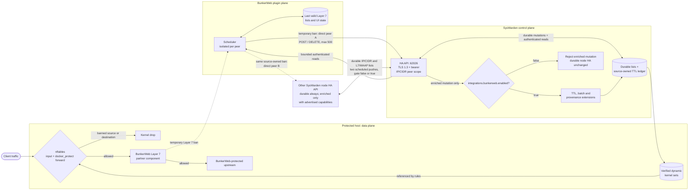

<p align="center">
  
  <br><br>
  <a href="https://github.com/duggytuxy/syswarden/actions/workflows/package.yml">
    
  </a>
  <a href="https://github.com/duggytuxy/syswarden/actions/workflows/security-audit.yml">
    
  </a>
  <a href="https://github.com/duggytuxy/syswarden/actions/workflows/scorecard.yml">
    
  </a>
  <a href="https://github.com/duggytuxy/syswarden/blob/main/LICENSE">
    
  </a>
</p>

# SysWarden v4

Current source version: **v4.02.10**.

> **Active Defense and HIDS/HIPS/WAAP Out-of-Band Orchestration for Critical Linux Infrastructure**

SysWarden is a host firewall orchestrator and an out-of-band security-log
analysis toolkit implemented primarily in Go. Its CLI manages configuration,
threat-intelligence lists, firewall rules, system services and optional
integrations. `syswarden-core` reads logs that another service has already
written and can add addresses to kernel firewall sets. It does not proxy,
terminate, inspect or sanitize live HTTP traffic.

This README describes the current repository state. A package being produced
by the build workflow is not, by itself, evidence that installation, upgrade,
restart and rollback have passed on the target operating system.

## Validation status

| Target | What the repository currently proves | Release qualification |
| :--- | :--- | :--- |
| Linux amd64 | The CLI, core and TUI compile and execute; unit, race, contract, package and golden-rule tests run in the candidate gates | The protected package lifecycle and privileged kernel labs must pass on the exact release SHA before a tag is created |
| Linux arm64 | The three binaries cross-compile and package metadata is checked against the exact architecture | The protected binfmt lifecycle must execute the exact candidate packages before release |
| Debian/Ubuntu `.deb` | amd64 and arm64 package contents, dependencies, maintainer scripts and lifecycle contracts are validated | The final protected install, upgrade, restart and rollback run remains mandatory |
| RHEL-family `.rpm` | x86_64 and aarch64 package contents, dependencies, maintainer scripts and lifecycle contracts are validated | The final protected install, upgrade, restart and rollback run remains mandatory |
| Alpine `.apk` | Dedicated x86_64 and aarch64 CGO-free static executables are packaged; the amd64 binary has no ELF interpreter and executes on standard Alpine musl | The exact x86_64 and aarch64 packages must still pass the protected lifecycle run |
| FreeBSD `.txz` | The amd64 package is ABI 14, uses native `/usr/local` paths, carries both rc.d scripts, cross-compiles, and has fail-closed package, PF and signed-updater contracts | The exact package lifecycle and signed updater transition must pass on the protected disposable FreeBSD VM |

These rows describe the source candidate and its gates, not an already
published release. Until the protected qualification passes for the exact
commit and artifacts, use SysWarden only in an isolated laboratory with console
access and a tested host snapshot or rollback path.

## Components and data flow

- `syswarden-cli` is the privileged operator interface.
- `syswarden-core` tails configured access or security logs, evaluates WAAP
  signatures and brute-force thresholds, and writes telemetry.
- `syswarden-tui` displays local telemetry in a terminal and opens no network
  listener itself. The current TUI implements a responsive layout, an ASCII
  24-hour rolling timeline whose buckets are stored in UTC while the current
  axis labels are rendered from local time, and profile-aware header tagging.
- `syswarden web-tui` exposes the terminal UI through HTTPS and WebSocket. It
  is a separate, network-facing mode with different risks.

```text
application or reverse-proxy logs
              |
              v
       syswarden-core
       |            |
       v            v
local telemetry   requested bans
       |            |
       v            v
syswarden-tui   nftables or pf
```

The WAAP engine is out-of-band log analysis. A detection can lead to a later
firewall update, but SysWarden is not in the HTTP request path and cannot clean
or rewrite a request before an application receives it.

## Implemented capabilities and limits

### Firewall and threat intelligence

The Linux implementation generates nftables rules and maintains IPv4 and IPv6
list files under `/etc/syswarden/lists`. The FreeBSD implementation generates
PF rules. GeoIP, ASN, custom feeds, whitelists, SSH exceptions, honeyports,
WireGuard and L2 options are configuration-controlled.

These controls can disconnect an administrator. Keep an out-of-band console,
back up the active configuration and firewall rules, and test rollback before
enabling strict allow lists, changing SSH access, or applying rules remotely.
On Linux, reload prepares and validates one complete nftables candidate, commits
it atomically under the shared SysWarden firewall lock, preserves active dynamic
bans, and verifies the resulting state. Compatibility wrappers are reconciled
after the nftables commit; if a wrapper fails, the command returns an error and
the verified nftables state remains authoritative for a safe retry. A policy
change or the normal `syswarden-core` restart can still disconnect an
administrator, so reload is not a connection-preservation guarantee.

### WAAP log analysis

`syswarden-core` can tail configured Nginx, Apache, Traefik, Caddy or other log
paths and evaluate signatures for SQL injection, XSS, LFI, RCE, scanners and
HTTP failure thresholds. Detection depends on the log format, log availability,
permissions and signature coverage. It does not replace an inline WAF, and the
repository does not establish a fixed service-count, false-positive rate,
latency or resource bound.

### Native TUI and Web-TUI

The native TUI is local and does not require an open port. The Web-TUI is
different: its default bind is `0.0.0.0:62027`, its service is enabled by the
current install path, it creates an in-memory self-signed certificate, and it
accepts a token through Basic authentication, a cookie or a legacy URL query
parameter. Restrict the listener with `--bind`, protect the port with a trusted
network control, and do not place tokens in URLs or logs.

A package-level `[webtui] enabled = false` switch and conditional ownership of
TCP 62027 are not part of v4.02.10. They remain a separate Lot 2 change. The
current package behavior must therefore be treated as Web-TUI enabled.

### High availability

When enabled, the HA API listens on configurable TCP port `62026` by default.
It uses TLS 1.3 with a persistent self-signed identity. On first use, the server
creates `/var/lib/syswarden/ha/server.crt` and
`/var/lib/syswarden/ha/server.key`, then reuses that identity across restarts.
The directory is private to the service and both identity files are created
with owner-only permissions. The generated certificate is valid for one year.
The server rejects a persisted identity outside its validity window. Replace
the certificate and key during a controlled maintenance window before expiry,
then redistribute only the new `server.crt` to TUI and `ha-sync` client hosts.

The native TUI verifies HA peer certificates. It uses
`/etc/syswarden/ha-ca.pem` when that bundle exists and otherwise uses the system
trust roots. For the default self-signed deployment, transfer each peer's public
`server.crt` certificate through a trusted out-of-band channel, verify its
fingerprint, and add it to the TUI host's CA bundle. Never copy `server.key` to
a client. Restart the native TUI after creating, replacing or removing the trust
bundle because trust roots are loaded when the process starts. The peer address
must match a DNS name or IP address in the certificate.

The native TUI and `syswarden ha-sync` use the same trust rule: when
`/etc/syswarden/ha-ca.pem` exists, that file is the exclusive HA trust pool;
otherwise they use the system trust roots. Both clients require TLS 1.3, reject
redirects and use bounded requests. A missing, unreadable, invalid or unsafe
explicit bundle causes a closed failure. The bearer token is required on
`/ha/sync`, `/ha/status` and `/ha/telemetry`; an empty or whitespace-padded token
prevents the HA listener from starting. A legacy client that omits the bearer
token receives `401 Unauthorized`; there is no tokenless compatibility mode.

`peer_ips` accepts exact IP addresses and canonical CIDRs. Exact addresses are
both inbound authorization entries and outbound synchronization destinations.
CIDRs authorize inbound peers only and are never converted into outbound URLs.
This permits a scheduler on a dedicated container network to change addresses
inside an operator-selected prefix without weakening bearer authentication. A
CIDR-only configuration is a valid inbound-only mode and installs no outbound
`ha-sync` cron entry.

The historical `/ha/sync` wire shape remains available for durable blocklist
replication when it is authenticated. The additive API also accepts temporary
bans with an integer TTL, claimed source and printable reason. Enriched requests
are limited to 500 bans per batch and a TTL between one second and 30 days.
SysWarden records the observed peer address and matched peer scope, reconciles
expiry with the active firewall backend, and exposes bounded provenance details
without changing the legacy `GET /ha/sync` response. The local ledger is stored
in `/var/lib/syswarden/ha/bans.json`.

One `syswarden ha-sync` invocation remains a bounded one-way push to exact
peers. Configure and schedule each SysWarden node against the other to obtain
A-to-B and B-to-A exchange; a CIDR is never an outbound destination. The
BunkerWeb integration uses the same authenticated API for temporary Layer 7
bans, blocklist retrieval and cached status/telemetry. It does not require
access to SysWarden files, the Docker socket or the SysWarden CLI.

Disabling the BunkerWeb integration does not disable node-to-node HA. Exact
SysWarden peers continue to exchange durable authenticated blocklist entries,
including operator-owned IP/CIDR entries and exact IPs persisted after local
Layer 7/WAAP detections. TLS 1.3 peer verification and the bearer token remain
mandatory in both directions; only the partner-specific enriched
TTL/provenance contract is gated.

Enabling BunkerWeb is equally additive: the same durable A-to-B and B-to-A
Layer 7/WAAP exchange continues. Source-owned temporary BunkerWeb bans are sent
directly by its multi-peer scheduler to each SysWarden peer; SysWarden nodes do
not relay those records transitively, which preserves their TTL and origin and
avoids synchronization loops.

### BunkerWeb integration contract

BunkerWeb's scheduler can push temporary Layer 7 bans to SysWarden and retrieve
SysWarden blocklist, whitelist, status and telemetry data through the HA API.



The final `false` branch means only that secure SysWarden node-to-node HA stays
available; it does not route partner requests through the other node.

The enriched TTL, batch and provenance extensions require the explicit
`[integrations.bunkerweb] enabled = true` gate, which defaults to `false` and is
validated against the authenticated HA configuration. The authenticated legacy
HA wire remains independent of this partner gate.

Run `sudo syswarden config`, choose `5` (`Integrations & HA`), configure
`[integrations.ha]` with a non-empty token and at least one exact IP or canonical
CIDR, then set `[integrations.bunkerweb] enabled = true`. Review the generated
`40-integrations.toml` and apply it with `sudo syswarden reload`; any validation
or reload error must be treated as a failed activation.
The scheduler must inspect the authenticated `/ha/status` capabilities and use
the enriched body only when both `sync_ttl` and `sync_provenance` are present.
Their absence means the authenticated historical HA contract only; it never
permits a TLS or bearer-token downgrade.

The scheduler should send at most 500 enriched bans per request, retain its last
valid cache when a response is invalid, and send the bearer token on every
request. The `source` field is a caller claim; SysWarden also records the
observed source address and matched `peer_ips` scope for operator attribution.

The initial partner design uses the following scheduler policy. These
frequencies are BunkerWeb plugin settings, not server-side polling performed by
SysWarden.

| Purpose | HA request | Planned frequency |
| :--- | :--- | :--- |
| Push or withdraw active Layer 7 bans | `POST` or `DELETE /ha/sync` | Once per minute when a diff exists |
| Retrieve the effective blocklist | `GET /ha/sync` | Once per minute, plus the hourly list refresh |
| Refresh Layer 7 blocklist and whitelist caches | `GET /ha/sync` and `GET /ha/telemetry` | Once per hour |
| Refresh the BunkerWeb status card | `GET /ha/status` and `GET /ha/telemetry` | Once per minute |

Each peer is isolated: an unavailable peer must not stop synchronization with
the others. The plugin uses only the authenticated HA API and never edits
`/etc/syswarden/lists`, invokes `syswarden-cli`, or accesses a SysWarden socket.
Plugin audit mode, last-known-good cache handling, Layer 7 whitelist priority,
fail-open behavior and Nginx reload avoidance are partner-side contracts and
must be proven in the BunkerWeb test stack rather than reported as SysWarden
test successes.

The partnership test matrix is deliberately split so that local API evidence is
not presented as an end-to-end plugin result.

| # | Planned partner scenario | Evidence in this repository | Required external evidence |
| :---: | :--- | :--- | :--- |
| 1 | A real Layer 7 attacker is banned and pushed | Authenticated temporary-ban API and kernel reconciliation | Real BunkerWeb detection, scheduler request and resulting kernel drop |
| 2 | A temporary ban is removed after expiry | TTL bounds, restart recovery and expiry reconciliation | Partner expiry/withdrawal cycle |
| 3 | Operator-owned entries survive plugin cycles | Source/scope ownership isolation | Multiple real scheduler cycles against an operator entry |
| 4 | Audit mode emits no mutations | Not executed here | BunkerWeb audit-mode job and request-log assertion |
| 5 | A downloaded blocklist causes a Layer 7 refusal | Read API only | BunkerWeb cache load and HTTP/preread decision |
| 6 | Whitelist takes priority over blocklist | Read API only | BunkerWeb Lua decision order |
| 7 | Peer outage remains fail-open with last-known-good cache | Not executed here | BunkerWeb outage and recovery stack |
| 8 | SysWarden state appears in the BunkerWeb UI | Authenticated bounded status and telemetry APIs | Scheduler cache plus UI rendering |
| 9 | Optional real-time push meets its latency target | Not executed here | BunkerWeb real-time path and timing assertion |
| 10 | TLS works in CA, fingerprint and explicit-unsafe modes | SysWarden TLS 1.3 and CA verification only | All three BunkerWeb client configurations; unsafe mode must remain explicit |
| 11 | Push-only cycles do not reload Nginx | Not executed here | BunkerWeb scheduler and process-state assertion |

On Linux, the `docker_protect` nftables chain is attached to the `forward` hook.
It checks both source and destination addresses against the dynamic bans and
SysWarden blocklists. This matters for container workloads because forwarded
traffic can bypass a host policy that protects only the `input` hook.

SysWarden does not yet expose a remote whitelist-write endpoint or per-client
scoped tokens. Those capabilities are deliberately outside this API revision;
the shared HA token grants the existing HA routes and must be protected as a
secret. For optional WAAP log analysis, mount the BunkerWeb Nginx log directory
on the host and configure the explicit mounted access-log path in
`waap.bruteforce_logs`.

### SIEM and webhooks

SIEM forwarding is implemented through rsyslog. UDP and cleartext TCP are
available. When a CA path is configured, the current rsyslog template uses
anonymous TLS authentication, so the documentation does not classify it as
strict authenticated TLS. Webhook URLs are operator-supplied destinations; the
current implementation has no destination allowlist or private-network
filtering. One setup request has a timeout, while another alert path uses the
default HTTP client without an explicit timeout.

## Network listeners

| Component | Default | Condition | Current security note |
| :--- | :--- | :--- | :--- |
| Native TUI | No listener | Launched with `syswarden tui` | Local terminal process |
| Web-TUI | `0.0.0.0:62027` | Service or `syswarden web-tui` is running | Self-signed TLS and bearer-style token; restrict the bind address |
| HA API | all interfaces on TCP `62026` | HA is enabled with at least one authorized IP/CIDR and a bearer token | Persistent TLS 1.3 identity; all routes require the bearer token; TUI and `ha-sync` verify with the explicit HA CA bundle or system roots |
| WireGuard | Configurable; legacy default `51820` | WireGuard is enabled | Verify the configured port and firewall rules on the host |

## Files and services on Linux

| Purpose | Current path or name |
| :--- | :--- |
| Binaries | `/opt/syswarden/bin/syswarden-cli`, `/opt/syswarden/bin/syswarden-core`, `/opt/syswarden/bin/syswarden-tui` |
| CLI links | `/usr/local/bin/syswarden`, `/usr/local/bin/syswarden-tui` |
| Master configuration | `/etc/syswarden/config/config.toml` |
| Ordered modules | `/etc/syswarden/config/modules/00-core.toml` through `99-user.toml` |
| Firewall and intelligence lists | `/etc/syswarden/lists` |
| HA API public certificate | `/var/lib/syswarden/ha/server.crt` |
| HA API private key | `/var/lib/syswarden/ha/server.key`; never copy it to a client |
| Native TUI HA trust bundle | `/etc/syswarden/ha-ca.pem`, with system roots used only when this file is absent |
| HA temporary-ban ledger | `/var/lib/syswarden/ha/bans.json` |
| HA outbound sync status | `/var/lib/syswarden/ha/sync-status.json` |
| Telemetry | `/var/lib/syswarden/ui/data.json` |
| Logs | `/var/log/syswarden` |
| systemd services | `syswarden-core.service`, `syswarden-firewall.service`, `syswarden-webtui.service` |

## Files and services on FreeBSD

| Purpose | Current path or name |
| :--- | :--- |
| Package binaries | `/usr/local/syswarden/bin/syswarden-cli`, `/usr/local/syswarden/bin/syswarden-core`, `/usr/local/syswarden/bin/syswarden-tui` |
| CLI links | `/usr/local/bin/syswarden`, `/usr/local/bin/syswarden-tui` |
| Configuration and modules | `/etc/syswarden/config/config.toml`, `/etc/syswarden/config/modules` |
| Runtime signature inventory | `/usr/local/syswarden/signatures.json` |
| Persistent data | `/var/lib/syswarden` |
| Package and PF recovery state | `/var/db/syswarden` |
| rc.d services | `/usr/local/etc/rc.d/syswarden`, `/usr/local/etc/rc.d/syswardenwebtui` |

The v4.02.10 PF contract is intentionally bounded. A fresh installation
requires PF to be disabled with an empty live ruleset before SysWarden first
mutates it. The separately byte-bound historical v4.02.8 transition is also covered. This
does not claim safe coexistence with an arbitrary pre-existing operator PF
policy.

## Build verification

The repository build script requires Go and PowerShell. The audited Lot 0
environment uses the official PowerShell 7.6.4 release. The script builds the
three components for linux/amd64, linux/arm64 and freebsd/amd64 and validates
the resulting executable inventory.

```bash
pwsh -File ./build.ps1
```

Building does not install or start SysWarden.

## Installation safety

The package workflow is configured to generate two DEB, two RPM, two APK and
one FreeBSD package plus `SHA256SUMS.txt`. Check the assets actually attached to
the selected GitHub release before using any filename or command.

Starting with the historical signed-protocol floor v4.02.9, a qualified release also carries
`syswarden-update-manifest-v1.json` and
`syswarden-update-manifest-v1.json.sig`. In this candidate, the manifest binds
the exact six Linux package identities and the FreeBSD amd64 TXZ identity,
including filenames, platforms, sizes and SHA-256 digests. The binary trusts the
embedded public key `syswarden-update-2026-01`; the matching Ed25519 private key
is held only by the protected release-qualification environment and is never a
repository file, command-line argument or release artifact.

> [!CAUTION]
> The current package post-install script invokes `syswarden-cli install`
> automatically. That operation can install dependencies, change SSH and host
> hardening, replace or modify firewall services, download feeds, create cron
> jobs, enable the Web-TUI, and restart services. Do not run it on a remotely
> administered host without console access, backups and a tested rollback.

For any platform, download only the package matching the host architecture and
its release checksum file, verify the exact package entry, inspect the package
scripts, and take a snapshot before invoking the package manager. Never invoke
`apk --allow-untrusted` on an unverified download. SysWarden uses that package
manager option only after the detached Ed25519 manifest and the package size and
SHA-256 have all been verified. Attestations, an SBOM or a checksum should be
relied upon only when that exact artifact is present and verifies for the
selected release.

The historical v4.02.8 binary predates the signed updater and cannot perform
the first signed hop. Linux hosts must install the separately verified
v4.02.10 package with their native package manager. FreeBSD hosts must first
install `curl`, `jq`, `libqrencode`, `rsyslog` and `wireguard-tools`, then use
`pkg add -f` on the checksum-verified v4.02.10 TXZ. Starting from an installed
v4.02.10, the signed updater supports the six Linux package targets and
FreeBSD amd64.

### Install the latest verified Release

The procedure below downloads exactly one package for the detected operating
system and architecture. Use it only after that tag is visible in GitHub
Releases and the release qualification is complete. For the first hop from
historical v4.02.8, run it as
`VERSION=v4.02.10 sh ./install-release.sh` after saving the block as
`install-release.sh`; leaving `VERSION` unset selects the latest published
Release automatically.

```sh
#!/bin/sh
set -eu

fetch_stdout() {
    url=$1
    if command -v curl >/dev/null 2>&1; then
        curl -fsSL "$url"
    elif command -v fetch >/dev/null 2>&1; then
        fetch -qo - "$url"
    elif command -v wget >/dev/null 2>&1; then
        wget -qO- "$url"
    else
        echo "curl, fetch or wget is required" >&2
        exit 1
    fi
}

download_file() {
    url=$1
    destination=$2
    if command -v curl >/dev/null 2>&1; then
        curl -fL --retry 3 -o "$destination" "$url"
    elif command -v fetch >/dev/null 2>&1; then
        fetch -qo "$destination" "$url"
    elif command -v wget >/dev/null 2>&1; then
        wget -qO "$destination" "$url"
    else
        echo "curl, fetch or wget is required" >&2
        exit 1
    fi
}

VERSION=${VERSION:-$(
    fetch_stdout https://api.github.com/repos/duggytuxy/syswarden/releases/latest |
        awk -F '"' '/"tag_name":/ { print $4; exit }'
)}
printf '%s\n' "$VERSION" | grep -Eq '^v[0-9]+\.[0-9]{2}\.[0-9]+$' || {
    echo "invalid or missing release tag: $VERSION" >&2
    exit 1
}
V_NUM=${VERSION#v}

SYSTEM=$(uname -s)
MACHINE=$(uname -m)
case "$SYSTEM" in
    Linux)
        test -r /etc/os-release || {
            echo "missing /etc/os-release" >&2
            exit 1
        }
        OS_IDS=$(sed -n -e 's/^ID=//p' -e 's/^ID_LIKE=//p' /etc/os-release |
            tr '\n' ' ' | tr -d "\"'")
        case " $OS_IDS " in
            *" alpine "*) FAMILY=apk ;;
            *" debian "*|*" ubuntu "*) FAMILY=deb ;;
            *" rhel "*|*" fedora "*|*" centos "*|*" rocky "*|*" almalinux "*) FAMILY=rpm ;;
            *) echo "unsupported Linux family: ${OS_IDS:-unknown}" >&2; exit 1 ;;
        esac
        ;;
    FreeBSD) FAMILY=txz ;;
    *) echo "unsupported operating system: $SYSTEM" >&2; exit 1 ;;
esac

case "$FAMILY:$MACHINE" in
    deb:x86_64|deb:amd64) PACKAGE="syswarden_${V_NUM}_amd64.deb" ;;
    deb:aarch64|deb:arm64) PACKAGE="syswarden_${V_NUM}_arm64.deb" ;;
    rpm:x86_64|rpm:amd64) PACKAGE="syswarden-${V_NUM}-1.x86_64.rpm" ;;
    rpm:aarch64|rpm:arm64) PACKAGE="syswarden-${V_NUM}-1.aarch64.rpm" ;;
    apk:x86_64|apk:amd64) PACKAGE="syswarden_${V_NUM}_x86_64.apk" ;;
    apk:aarch64|apk:arm64) PACKAGE="syswarden_${V_NUM}_aarch64.apk" ;;
    txz:amd64|txz:x86_64) PACKAGE="syswarden-${V_NUM}.txz" ;;
    *) echo "unsupported architecture: $SYSTEM/$MACHINE" >&2; exit 1 ;;
esac

umask 077
WORKDIR="syswarden-release-${VERSION}"
mkdir "$WORKDIR"
cd "$WORKDIR"
BASE_URL="https://github.com/duggytuxy/syswarden/releases/download/${VERSION}"
download_file "${BASE_URL}/${PACKAGE}" "$PACKAGE"
download_file "${BASE_URL}/SHA256SUMS.txt" SHA256SUMS.txt

MATCH_COUNT=$(awk -v file="$PACKAGE" '
    $2 == file || $2 == ("*" file) { count++ }
    END { print count + 0 }
' SHA256SUMS.txt)
test "$MATCH_COUNT" -eq 1 || {
    echo "checksum manifest must contain exactly one entry for $PACKAGE" >&2
    exit 1
}
EXPECTED=$(awk -v file="$PACKAGE" '
    $2 == file || $2 == ("*" file) { print $1; exit }
' SHA256SUMS.txt)
if command -v sha256sum >/dev/null 2>&1; then
    ACTUAL=$(sha256sum "$PACKAGE" | awk '{ print $1 }')
else
    ACTUAL=$(sha256 -q "$PACKAGE")
fi
test "$ACTUAL" = "$EXPECTED" || {
    echo "SHA-256 verification failed for $PACKAGE" >&2
    exit 1
}
echo "SHA-256 verified: $PACKAGE"

if test "$(id -u)" -eq 0; then
    ELEVATE=
elif command -v sudo >/dev/null 2>&1; then
    ELEVATE=sudo
elif command -v doas >/dev/null 2>&1; then
    ELEVATE=doas
else
    echo "run the installation step as root, with sudo or with doas" >&2
    exit 1
fi

case "$FAMILY" in
    deb) $ELEVATE apt-get install -y "./$PACKAGE" ;;
    rpm) $ELEVATE dnf install -y "./$PACKAGE" ;;
    apk) $ELEVATE apk add --allow-untrusted "./$PACKAGE" ;;
    txz)
        $ELEVATE pkg install -y curl jq libqrencode rsyslog wireguard-tools
        $ELEVATE pkg add -f "./$PACKAGE"
        ;;
esac
```

The checksum must pass before `apk --allow-untrusted` is reached. The package
post-install hook performs the initial `syswarden install`. Review the manual
and configuration afterward; rerun the installation command only when you
intend to reapply the configured host controls:

```sh
sudo syswarden manual
sudo syswarden config
sudo syswarden install
```

## Configuration

Configuration is loaded from `/etc/syswarden/config/config.toml` and ordered
TOML files below `/etc/syswarden/config/modules`. Later filenames override
earlier modules; `99-user.toml` is reserved for operator overrides. The legacy
`/opt/syswarden/syswarden-auto.conf` format remains available for migration.

Use the interactive editor or place a small override in `99-user.toml`:

```toml
[core]
ssh_port = "22"

[waap]
enforcement_mode = "audit"
bruteforce_logs = "/var/log/nginx/access.log"
bruteforce_threshold = 5
bruteforce_window_seconds = 60

[integrations.ha]
enabled = false
peer_ips = []
peer_port = 62026
token = ""

[integrations.bunkerweb]
enabled = false

[user]
webtui_password = ""
```

Back up the complete configuration directory before editing. Validate the
result locally before applying it. The empty token shown above is valid only
because HA is disabled. Enabling HA requires a non-empty token and at least one
exact peer IP or canonical CIDR. The BunkerWeb extensions are also disabled by
default; enabling them requires a valid enabled HA configuration.

## Operator commands

Use `syswarden --help` and command-specific help as the command contract. The
main commands include:

```text
alerts             Stream the alert dashboard.
allow-ssh          Add an SSH exception registry entry; verify the kernel rule.
audit              Run a local operational diagnostic, not a compliance audit.
block              Add addresses or CIDRs to the persistent blocklist.
check              Inspect one address.
config             Open the configuration editor.
config-get         Read one modular configuration key.
ha-sync            Push missing local blocklist entries to configured HA peers.
install            Apply the installation pipeline; this is host-mutating.
list               Show manual registries.
manual             Display the embedded operator reference.
migrate-config     Convert a legacy configuration.
reload             Reapply policy and normally restart the core.
revoke-ssh         Remove an SSH exception registry entry.
tui                Launch the local terminal dashboard.
unblock            Remove addresses or CIDRs from the blocklist.
uninstall          Delete SysWarden services, rules, configuration, data and logs.
unwhitelist        Remove addresses or CIDRs from the whitelist.
update             Run the signed in-place updater; see the version and first-hop warning below.
update-feeds       Refresh feeds and reapply firewall policy.
web-token          Display the configured token or persist a replacement and request a Web-TUI restart.
web-tui            Start the network-facing Web-TUI server.
whitelist          Add addresses or CIDRs to the whitelist.
whitelist-infra    Detect and add local infrastructure addresses.
```

If no token is configured, `syswarden web-token` generates and persists one
even without `--rotate`, then requests a `syswarden-webtui.service` restart.
`--rotate` persists a replacement token and requests the same platform service
restart. If that restart fails, the command returns nonzero and reports partial
state; a running Web-TUI process may continue accepting the previous token.

The port-specific bypass semantics of `allow-ssh` and `revoke-ssh` have not
passed a privileged kernel contract test. Do not depend on them for remote
access recovery.

## Lifecycle warnings

- `syswarden reload` reapplies firewall policy, repairs cron entries and
  normally restarts `syswarden-core.service`. Take a ruleset snapshot and keep
  console access before running it.
- `syswarden audit` is a local operational diagnostic. Its output is not an
  ISO 27001, NIS2, CRA or CIS certification.
- `syswarden update` accepts the historical v4.02.9 protocol floor and later
  only when the release provides a
  canonical manifest and detached Ed25519 signature trusted by the binary. It
  verifies the selected OS/architecture filename, size and SHA-256 again
  immediately before invoking the package manager, and uses a private temporary
  workspace. The historical v4.02.8 binary predates this trust root, so its
  first upgrade to v4.02.10 must be a separately verified manual package
  upgrade. From v4.02.10 onward, FreeBSD amd64 uses the same signed contract and
  invokes native `pkg add -f` only after all verification succeeds.
- `syswarden uninstall` is destructive. It deletes SysWarden configuration,
  data, logs, services and firewall tables. It does not restore every previous
  host setting. Back up `/etc/syswarden`, `/var/lib/syswarden`, relevant logs,
  firewall state, SSH configuration and hardening files before considering it.
  On FreeBSD, use this supported command rather than raw `pkg delete`: pkg does
  not guarantee that a failing pre-deinstall script aborts payload removal, and
  `pkg delete -D` skips package scripts entirely.

## Security posture and limitations

- SysWarden runs privileged operations and can cause network lockout or service
  interruption. An out-of-band recovery path is a prerequisite.
- Firewall changes can still interrupt connectivity. Keep console access and a
  ruleset snapshot even when the transactional preflight and post-verification
  gates pass.
- WAAP is based on previously written logs and cannot stop a request before it
  reaches the logging application.
- HA uses one shared bearer token rather than separately scoped client tokens.
  The default self-signed identity requires an authenticated out-of-band trust
  bootstrap before the TUI or `ha-sync` can connect.
- Web-TUI listens on all interfaces by default and uses a self-signed
  certificate plus a shared token.
- SIEM TLS currently uses anonymous authentication.
- Webhook destinations are not protected by a complete SSRF policy.
- Signed update manifests use the historical v4.02.9 protocol floor. The release signing private
  key remains an external protected-environment secret and is not recoverable
  from this repository.
- Complete install, upgrade, restart and rollback evidence must pass on the
  exact protected release candidate before any operating-system or architecture
  combination is called release-qualified.
- SysWarden provides controls and audit evidence that may assist a security
  program; it is not a regulatory certification or a substitute for an
  independent assessment.

Security issues should be reported according to [SECURITY.md](SECURITY.md).

## Documentation

The separate [SysWarden wiki](https://github.com/duggytuxy/syswarden/wiki)
contains deployment notes and use cases. Wiki changes use a separate review and
maintainer-controlled publication gate; a wiki page may lag the source until
that gate is completed. When the wiki and this README disagree, prefer tested
behavior in the source candidate and report the inconsistency.

The version-specific [Lot 1 public security delivery report](docs/reports/LOT1_PUBLIC_SECURITY_REPORT_v4.02.10.md)
records the v4.02.10 source scope, evidence, platform boundaries and final
release decision.

## Target and support

> Goal: 37% reached/year (Goal) to fund continuous DevSecOps improvements and infrastructure.

Developing SysWarden and maintaining the Data-Shield IPv4 blocklists requires
server infrastructure and ongoing monitoring. Contributions and support help
fund that work.

[](https://ko-fi.com/laurentmduggytuxy)

## License

SysWarden is free and open-source software distributed under the
[GNU General Public License v3.0](LICENSE).

*Developed and maintained by DuggyTuxy (Laurent M.).*
