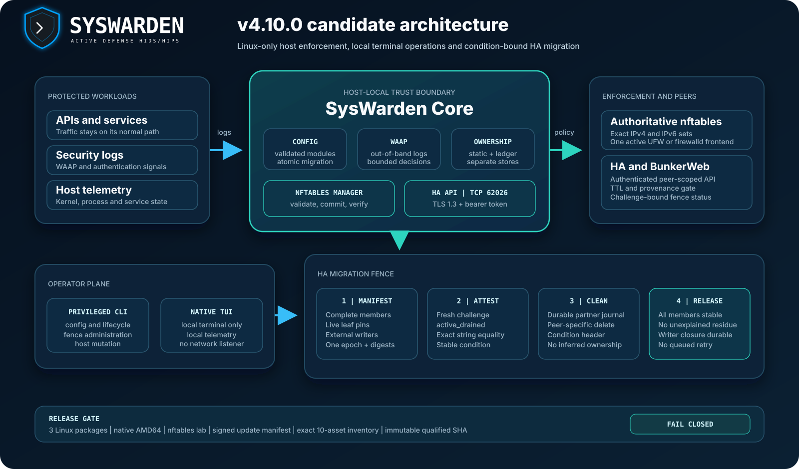

<div align="center">
  
</div>

# SysWarden

SysWarden is a Linux host firewall orchestrator and out-of-band security-log
analysis toolkit. It combines nftables policy, local threat-intelligence lists,
WAAP log analysis, host telemetry, authenticated HA exchange and a native local
terminal dashboard.

It is not an inline HTTP proxy, a traffic sanitizer or a regulatory
certification product.

Current source version: **v4.03.1**.

Target candidate: **v4.03.1**. This documentation describes the candidate
contract. It does not claim that v4.03.1 is qualified, tagged or published.
Publication remains blocked until every protected gate passes on one exact
merged commit.

<div align="center">
  
</div>

## Supported targets and qualification

| Target | Candidate artifact | Required release proof |
| --- | --- | --- |
| Debian or Ubuntu amd64 | `syswarden_4.03.1_amd64.deb` | Native install, upgrade, restart, removal and rollback lifecycle |
| Debian or Ubuntu arm64 | `syswarden_4.03.1_arm64.deb` | Native ARM64 lifecycle on the exact candidate package |
| RHEL-family x86_64 | `syswarden-4.03.1-1.x86_64.rpm` | Native install, upgrade, restart, removal and rollback lifecycle |
| RHEL-family aarch64 | `syswarden-4.03.1-1.aarch64.rpm` | Native ARM64 lifecycle on the exact candidate package |
| Alpine x86_64 | `syswarden_4.03.1_x86_64.apk` | Native OpenRC lifecycle with the dedicated CGO-free executable |
| Alpine aarch64 | `syswarden_4.03.1_aarch64.apk` | Native ARM64 OpenRC lifecycle with the dedicated CGO-free executable |

The package workflow is configured to generate two DEB, two RPM and two APK
packages plus `SHA256SUMS.txt`. No current package or updater route exists
outside this Linux matrix. ARM64 qualification uses a native runner, not CPU
emulation.

## Exact release inventory

A qualified v4.03.1 Release contains exactly thirteen public assets:

1. `syswarden_4.03.1_amd64.deb`
2. `syswarden_4.03.1_arm64.deb`
3. `syswarden-4.03.1-1.x86_64.rpm`
4. `syswarden-4.03.1-1.aarch64.rpm`
5. `syswarden_4.03.1_x86_64.apk`
6. `syswarden_4.03.1_aarch64.apk`
7. `SHA256SUMS.txt`
8. `RELEASE_SHA256SUMS.txt`
9. `syswarden-release.tar.gz`
10. `syswarden-sbom.spdx.json`
11. `plumber-report.zip`
12. `syswarden-update-manifest-v1.json`
13. `syswarden-update-manifest-v1.json.sig`

The release manager rejects missing, duplicate or unexpected assets. The
package checksum inventory, release checksum inventory and detached Ed25519
update signature are verified before publication.

## Core behavior

- The CLI maintains persistent whitelist, blocklist and SSH-exception
  registries using exact canonical IP, CIDR and supported service entries, then
  reapplies host firewall policy after controlled changes.
- The core analyzes configured logs out of band and can persist WAAP decisions
  into the host firewall state.
- Linux enforcement uses nftables. Candidate rules are validated before the
  authoritative ruleset is committed.
- The TUI reads local telemetry and HA status. It runs inside the invoking
  terminal and opens no listening socket.
- The HA API uses TLS 1.3, a bearer token and a configurable port whose default
  is TCP 62026.
- The BunkerWeb extension is disabled by default and requires authenticated HA
  before TTL and provenance operations are enabled.

## Local terminal boundary

Run the native dashboard from a trusted local console or SSH session:

```console
sudo syswarden tui
```

The current product contains no browser terminal, HTTPS or WebSocket terminal
bridge, remote PTY route, token-management command or network terminal service.
SysWarden owns no listener and no generated firewall permission on TCP 62027.

Upgrade cleanup is deliberately bounded: it removes only verified historical
SysWarden state, preserves unrelated configuration and must not stop an
unrelated process that happens to use the same port.

## Installation and upgrade

Use only assets attached to the intended GitHub Release. Replace the example
version only after that tag is public and its complete inventory is visible.

```console
VERSION=4.03.1
TAG="v${VERSION}"
```

Download exactly one package for the host plus `SHA256SUMS.txt`, then verify the
package before invoking the native package manager:

```console
sha256sum --check --ignore-missing SHA256SUMS.txt
```

Stop if the selected package is not reported as valid. Then use the matching
native command:

```console
sudo apt-get install -y ./syswarden_4.03.1_amd64.deb
sudo dnf install -y ./syswarden-4.03.1-1.x86_64.rpm
sudo apk add --allow-untrusted ./syswarden_4.03.1_x86_64.apk
```

Run only the command for the actual distribution and architecture. For APK,
`--allow-untrusted` is acceptable only after the exact SHA-256 verification has
succeeded.

The historical public v4.02.8 binary predates the signed updater protocol. Its first hop
must use a separately downloaded and checksum-verified Linux package. After a
qualified signed-protocol release is installed, `syswarden update` verifies the
canonical manifest, detached Ed25519 signature, platform identity, package size
and SHA-256 digest before installation.

Before any upgrade:

1. retain verified local console or SSH access;
2. back up `/etc/syswarden`, required list files and HA trust material;
3. save the current nftables ruleset and package version;
4. verify that TCP 62027 is blocked at the host boundary;
5. test the rollback package and recovery access on a representative host.

## Configuration

The modular configuration root is `/etc/syswarden/config`. Later module
filenames have higher precedence. Back up the complete directory before an
edit, validate the candidate and apply it only after reviewing the effective
diff.

`schema_version = 1` is the current modular schema. When `schema_version` is
absent, the configuration is treated as historical input. An explicit future,
negative or non-integer schema version fails closed.

Validate without editing files or applying environment overrides:

```console
sudo syswarden config validate --path /etc/syswarden/config
```

`syswarden config validate` is read-only. All unknown and deprecated keys are
reported as diagnostics; a semantic or structural violation still fails
validation. The CLI validator and core loader enforce the same semantic matrix
for blocklist choice, URL and hash combinations, Wazuh endpoint completeness,
compliance intervals, SHA-256 prefixes, trimmed HA peers and SSH/HA port
separation while WireGuard is enabled.

Preview a historical-to-modular migration before publishing any file:

```console
sudo syswarden config migrate \
  --source /opt/syswarden/syswarden-auto.conf \
  --output /etc/syswarden/config \
  --dry-run
```

`syswarden config migrate --dry-run` performs zero source or destination
writes, including when a previous migration transaction requires recovery.
`syswarden migrate-config` remains a compatibility alias with the same
transactional and dry-run contract.

The official SaaS monitor setting is disabled unless explicitly enabled:

```toml
[network.saas]
allow_monitors = false
```

`network.saas.allow_monitors` takes precedence over the deprecated
`integrations.saas.enabled` alias; if neither is set, monitor allowlisting is
disabled. Enabled monitor feeds must use absolute HTTPS URLs without
credentials or fragments. TLS 1.3 is required, redirects are rejected and each
download is bounded to 10 seconds, 1 MiB, 1,024 bytes per line, 20,000 lines
and 10,000 entries. A required-feed, syntax or bound failure preserves the
previous lists. Valid canonical IPv4 and IPv6 results are published as one
lock-coordinated atomic pair with an SHA-256 pair manifest and rollback on
publication failure.

WAAP log settings use canonical single-space-separated absolute patterns.
Configured globs are reduced to verified exact real regular-file matches. The
core opens them descriptor-relative without following links and revalidates the
file identity and type after every rotation; it never creates a missing target.
Rsyslog inputs are emitted only for paths that pass the same validation at
configuration time, but rsyslog later reopens those names itself, so operators
must keep every parent directory protected against untrusted replacement.
Rsyslog strings and WireGuard values are validated and encoded for their
destination grammars before configuration publication.

## Persistent list grammar

Blocklist, whitelist and SSH-exception values use exact canonical IPv4 or IPv6
addresses and masked CIDRs. Hostnames, address zones, IPv4-mapped IPv6 values,
invalid ports, control characters and ambiguous substring matches are rejected.
The address family must match the destination list.

Use the explicit flag to limit a whitelist entry to one TCP service:

```console
sudo syswarden whitelist 192.0.2.10 --port 443
```

`--port` scopes a whitelist entry to one TCP service; omitting it creates an
address-wide whitelist entry. SSH exceptions are rendered only for the
effective SSH port. A port-qualified SSH entry must equal that effective port,
and a changed-port mismatch fails closed before candidate policy application.
Reconcile the SSH exception registry from verified console access before
applying an SSH port change.

Minimal authenticated HA and BunkerWeb example:

```toml
[integrations.ha]
enabled = true
peer_ips = ["192.0.2.10", "192.0.2.11"]
peer_port = 62026
token = "replace-with-a-secret-from-a-protected-channel"

[integrations.bunkerweb]
enabled = true
```

Do not commit a real HA token. Exact peer IPs may be dialed. Canonical CIDRs are
inbound authorization ranges only and are never outbound destinations. When
`/etc/syswarden/ha-ca.pem` exists, clients use that explicit trust bundle;
otherwise they use the system trust store.

## HA dialect and ownership rules

One authenticated `GET /ha/status` selects the dialect independently for each
peer and for one serialized synchronization cycle. Enriched operations require
both `sync_ttl` and `sync_provenance`. A missing, partial, malformed or failed
capability response stops the handoff for that peer and never downgrades TLS or
bearer authentication.

The ownership stores and delete operations remain separate:

- `DELETE {"bans": [...]}` removes provenance ledger entries only;
- `DELETE {"ips": [...]}` explicitly removes historical static entries;
- neither operation cascades into another peer;
- the integrator cleans only addresses present in its durable, peer-specific
  record of historical submissions;
- ownership is never inferred from `GET /ha/sync`, provenance pagination or an
  effective union returned by a peer.

This separation prevents an integrator from deleting a local operator entry,
a WAAP-owned entry or another producer's durable claim.

## HA migration fence

Historical-to-provenance cleanup is a cluster campaign, even though every HA
mutation remains peer-scoped. The operator owns the complete member and
external-writer inventory. SysWarden owns the per-node native-sync fence. The
integrator owns the durable per-peer journal, explicit cleanup requests and
completion decision.

### Operator workflow

One trusted control host creates one protected activation manifest and
distributes that same file to every member and to the integrator:

```console
sudo syswarden ha-fence manifest create \
  --inventory /root/syswarden-ha-inventory.json \
  --output /root/syswarden-ha-manifest.json \
  --assert-complete
sudo syswarden ha-fence manifest verify \
  --manifest /root/syswarden-ha-manifest.json
sudo syswarden ha-fence engage \
  --manifest /root/syswarden-ha-manifest.json
sudo syswarden ha-fence status --json
```

Manifest files are strict, canonical, owner-only inputs. Creation performs a
fresh authenticated and challenge-bound status request to every exact member,
verifies the live TLS leaf identity and records one random campaign epoch. A
member, endpoint, certificate or external-writer change requires a new
manifest and resets every partner observation window.

Release is root-only and requires the unchanged manifest plus durable terminal
closure evidence for every external legacy writer:

```console
sudo syswarden ha-fence release \
  --manifest /root/syswarden-ha-manifest.json \
  --writer-closure /root/syswarden-ha-writer-closure.json
```

Use `ha-fence recover` with the same manifest after an interrupted engagement.
Never engage a retired epoch and never reconstruct a manifest from peer output.

### Integrator verification

The capability `native_sync_fence_v1` announces schema support only. It is not
evidence that a fence is active or drained.

For every manifest member, the integrator obtains one fresh authenticated,
challenge-bound `GET /ha/status` response over the verified and leaf-pinned TLS
connection. It accepts fence evidence only when all of these values match the
operator manifest and the same response:

- `native_sync_fence.state` is `active_drained`;
- the challenge echo matches the unique request challenge;
- the live leaf certificate SHA-256 matches the manifest member;
- `epoch` equals the manifest epoch;
- `membership_sha256` equals the manifest membership digest;
- `legacy_writer_inventory_sha256` equals the manifest writer digest;
- the `X-SysWarden-HA-Fence-Condition` response header equals the JSON
  `condition` value;
- server instance, generation, condition and membership remain stable for the
  accepted observation.

The integrator treats the epoch and both digest values as opaque,
case-sensitive strings. It compares them for exact equality and does not
recalculate either digest or reimplement SysWarden canonicalization.

Every explicit historical cleanup request sends the observed value in:

```text
X-SysWarden-HA-Fence-Condition: <condition>
```

While the fence is active and drained, a missing condition receives HTTP 428,
a malformed condition receives HTTP 400 and a stale condition receives HTTP
412. Each rejection performs no mutation. HTTP 412 means the fence changed;
the integrator stops, refreshes the complete all-member proof and requires an
operator decision instead of blindly retrying.

An unavailable member, blind interval, changed membership, changed certificate,
changed server instance, changed generation or reappearing address resets the
partner observation. A one-hour continuous absence window is additional
evidence only. It is never proof of drain and never permits claim release from
a partial cluster view.

## Operator commands

The table lists product commands only. Cobra help and shell-completion utilities
remain available separately.

| Command | Purpose |
| --- | --- |
| `alerts` | Stream kernel and WAAP alert events |
| `allow-ssh` | Add an address to the SSH exception registry |
| `audit` | Run a bounded local operational diagnostic |
| `block` | Add addresses or CIDRs to the persistent blocklist |
| `check` | Inspect recorded firewall state for an address |
| `config` | Validate, inspect and migrate modular configuration |
| `config-get` | Read one effective configuration key |
| `ha-fence` | Administer a cluster migration fence |
| `ha-sync` | Push missing local durable entries to exact peers |
| `install` | Run the host-mutating installation pipeline |
| `list` | Display local registries and active HA bans |
| `manual` | Display the built-in operator reference |
| `migrate-config` | Run the compatible legacy configuration migration entry point |
| `reload` | Reapply policy and normally restart the core |
| `revoke-ssh` | Remove an address from the SSH exception registry |
| `tui` | Launch the native local terminal dashboard |
| `unblock` | Remove addresses or CIDRs from the blocklist |
| `uninstall` | Delete SysWarden services, rules, configuration, data and logs |
| `unwhitelist` | Remove addresses or CIDRs from the whitelist |
| `update` | Install an update verified by the signed manifest |
| `update-feeds` | Download configured feeds and reapply firewall policy |
| `whitelist` | Add addresses or CIDRs to the persistent whitelist |
| `whitelist-infra` | Detect and add local infrastructure addresses |

Use `syswarden <command> --help` before any host-mutating action.

## Files, services and ports

| Surface | Linux path or default |
| --- | --- |
| Modular configuration | `/etc/syswarden/config` |
| Legacy configuration input | `/opt/syswarden/syswarden-auto.conf` |
| HA client trust bundle | `/etc/syswarden/ha-ca.pem` |
| HA server identity | `/var/lib/syswarden/ha/server.crt` and `server.key` |
| Local telemetry | `/var/lib/syswarden/ui/data.json` |
| Persistent IP registries | `/etc/syswarden/lists` |
| Logs | `/var/log/syswarden` |
| Core service | `syswarden-core.service` or OpenRC equivalent |
| Firewall service | `syswarden-firewall.service` or OpenRC equivalent |
| HA API | TCP 62026 by default, configurable |
| Native TUI | No listening port |

Never copy `server.key` to a client. Transfer only the public certificate or CA
material through a trusted channel and verify its fingerprint before trust is
enabled.

## Security posture and limitations

- Keep recovery access before applying firewall, SSH, package or migration
  changes. Test from a second session before closing the first.
- `reload` commits a validated nftables candidate and normally restarts the
  core. It is not a zero-interruption guarantee.
- `audit` inspects selected local services, files, firewall state and
  configuration. It is not a compliance certification.
- WAAP decisions are derived from logs already written by another service.
  SysWarden does not proxy or sanitize live HTTP requests.
- HA requires a complete operator inventory. A peer list, status response or
  effective union cannot prove cluster completeness.
- BunkerWeb migration cleanup remains limited to the partner's durable
  ownership journal. Ambiguous co-ownership requires operator review.
- SIEM, webhook and external feed security also depends on the configured
  remote endpoint, trust material and network policy.
- On Alpine Linux, SysWarden does not configure automatic operating-system
  security updates. Repository selection and the `apk` update policy remain
  an explicit operator responsibility.
- `uninstall` removes configuration, state and logs and does not restore every
  prior host setting. Back up required data before use.
- A downgrade is a controlled emergency action. Keep TCP 62027 blocked and do
  not restore retired authentication material.
- Support and qualification claims apply only to the exact package matrix and
  evidence described in this document.

## Release evidence and report

The [v4.03.1 public release readiness report](docs/reports/PUBLIC_RELEASE_READINESS_REPORT_v4.03.1.md)
records the exact package and asset inventory, migration contract, security
limits and remaining release gates.

The report and this README remain candidate documentation until protected
qualification passes and the maintainer authorizes the immutable tag.

## License

See [LICENSE](LICENSE).
