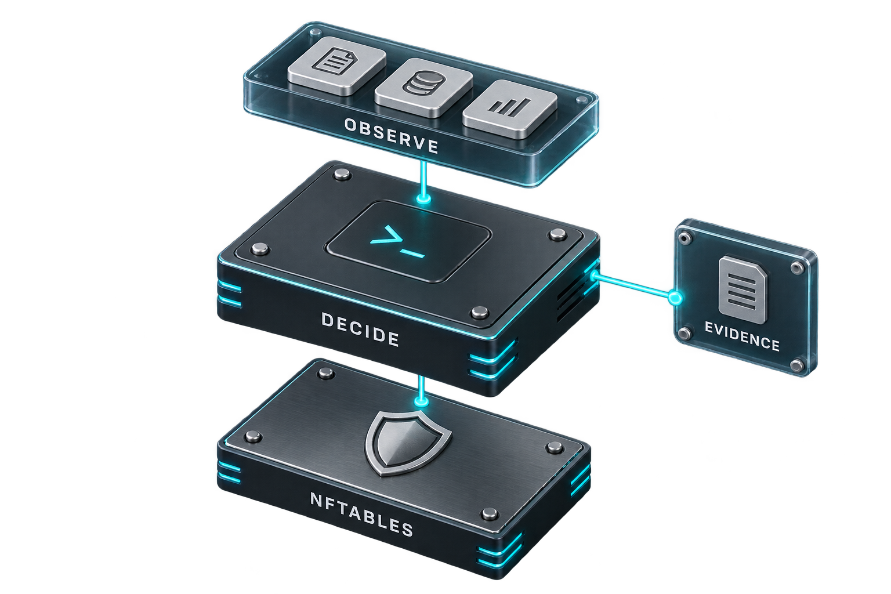

  

 

  
  
  
  
  
  
  

# SysWarden

**Linux defense. Your host. Your rules.**

Host-local Linux defense with auditable, fail-closed enforcement.

[Website](https://syswarden.io/) |
[Documentation](https://syswarden.io/docs/) |
[Build from source](https://syswarden.io/docs/build-from-source/) |
[Roadmap](https://github.com/duggytuxy/syswarden/issues/222)

SysWarden is an open-source Linux security orchestrator that combines an
authoritative nftables policy, host telemetry, threat-intelligence lists,
out-of-band WAAP log analysis, authenticated high availability and a native
terminal dashboard. It is designed for operators who want one reviewable host
defense layer without placing another proxy in the application data path.

SysWarden is not an inline HTTP proxy, a traffic sanitizer or a regulatory
certification product.

Current source version: **v4.10.1**.

The latest IVV-validated, stable public release is
[v4.10.0](https://github.com/duggytuxy/syswarden/releases/tag/v4.10.0).

Published on 1 October 2026 with a signed tag, four signed Linux package
variants and twelve verified release assets. The
[publication record and verification evidence](docs/releases/v4.10.0/README.md)
identify the exact tested product, publication commit and Sigstore signatures.

Intermediate `Patch`, `Minor` and `Major` releases follow IVV (Integration,
Verification and Validation). Version-specific `Upgrade` generations such as v5.00.0 require
full IVVQ, including Qualification. v4.10.0 is an IVV release and does not claim
full IVVQ qualification. Later source builds do not inherit its verdict.
Check each [technical document](docs/technical/) for its exact version and scope.

## Observe, decide, enforce

  

SysWarden observes host signals, evaluates operator policy and applies validated
actions through nftables. Logs and release evidence help operators review what
was observed and exercised. This illustration summarizes the defense model;
individual capabilities remain subject to their documented version and scope.

## Features

- Authoritative nftables enforcement with bounded firewalld and UFW
  compatibility when exactly one supported frontend is already active.
- Persistent blocklists, whitelists and SSH exceptions with canonical IP,
  CIDR and service-scoped entries.
- Host telemetry and out-of-band WAAP log analysis for local detection and
  response workflows.
- Bounded threat-intelligence feeds with last-known-good publication behavior.
- Native local terminal dashboard with no browser service or listening port.
- Authenticated HA synchronization over TLS 1.3 with explicit ownership and
  migration-fence controls.
- Optional BunkerWeb integration with authenticated HA and provenance-aware
  cleanup.
- Native DEB, RPM and APK packaging for supported amd64 Linux hosts.

## Capabilities

| Area | What SysWarden provides |
| --- | --- |
| HIDS | Host-local telemetry, security-log analysis and alert visibility |
| HIPS | Validated policy decisions enforced through authoritative nftables rules |
| WAAP | Out-of-band analysis of logs written by a supported upstream service |
| Threat intelligence | Canonical local lists and bounded external feed updates |
| High availability | TLS 1.3, bearer authentication and peer-scoped synchronization |
| Operations | Local CLI and TUI, modular configuration, audit and lifecycle controls |
| Supply chain | Checksummed Linux packages, signed update metadata and release evidence |

## BunkerWeb integration plugin

Use the optional BunkerWeb integration plugin to connect supported BunkerWeb
security events to SysWarden host enforcement through the authenticated HTTPS
API. The [integration guide](https://syswarden.io/docs/bunkerweb-integration/)
covers configuration and compatibility. Follow the version-specific prerequisites
before enabling synchronization or HA v2.

## Release inventory and verification

The stable v4.10.0 release publishes a machine-readable SPDX software bill of
materials, [syswarden-sbom.spdx.json](https://github.com/duggytuxy/syswarden/releases/download/v4.10.0/syswarden-sbom.spdx.json),
for dependency review. An SBOM is an inventory, not a vulnerability-free claim.

`SHA256SUMS.txt` checks package integrity against the downloaded inventory.
Authenticate the Ed25519-signed update manifest with an independently trusted
release key before installing a manually downloaded package. The
[operator guidance](docs/technical/OPERATOR_VERSION_AND_DIAGNOSTICS.md#authenticate-a-manual-package-download)
explains the existing verifier, its trust prerequisites and the distinction
between package authentication and the SBOM inventory.

## Intelligence Sources

| Source | Use and trust boundary |
| --- | --- |
| [Data-Shield](https://github.com/duggytuxy/Data-Shield_IPv4_Blocklist) | Official maintainer-curated IPv4 feed for the standard and critical profiles; SysWarden accepts it locally only after canonical validation and quorum controls |
| [IPverse country IP blocks](https://github.com/ipverse/country-ip-blocks) | Pinned CC0-1.0 RIR allocation snapshot embedded in the release-bound CLI; allocation country is not physical or current operational geolocation |
| [WiredAlter IP Service](https://ip.wiredalter.com/) ([source](https://github.com/buildplan/ip-service)) | Best-effort cached country, ASN, organization and threat labels for Top Attackers / OSINT History display only; responses never influence severity or firewall decisions |
| [CINS Score](https://cinsscore.com/list/ci-badguys.txt) and [blocklist.de](https://lists.blocklist.de/lists/all.txt) | Only exact entries found at both independent origins are published |
| [Spamhaus](https://www.spamhaus.org/) and [RADB](https://www.radb.net/) | Signals may be operator-provisioned; neither source is accepted as firewall authority by itself |
| Custom HTTPS feed | Choice 3 requires an HTTPS URL and its exact SHA-256 digest for each configured address family |

## Why Choose SysWarden

- **Host-local by design.** Security decisions stay close to the protected
  Linux host, without an inline proxy or remote terminal listener.
- **Fail-closed boundaries.** Ambiguous configuration, identity, feed or HA
  state is rejected before security policy is published.
- **Operator control.** Existing firewall service ownership is preserved, and
  host mutation remains explicit and reviewable.
- **Auditable delivery.** Source, package, security, compliance and release
  assurance gates expose the evidence behind each release decision.
- **Open source.** The implementation and its operational boundaries can be
  inspected, tested and improved by the community.

## Documentation

Operational procedures are centralized in the
[SysWarden documentation](https://syswarden.io/docs/).
The former wiki pages are preserved there with search, copyable commands and
explicit version badges. Historical v4.04.3 procedures retain their original
scope; use the current getting-started page for the v4.10.0 release.

| Goal | Documentation |
| --- | --- |
| Verify and install v4.10.0 | [Get started with the signed release](https://syswarden.io/docs/getting-started/) |
| Build from an exact reviewed source revision | [Build and install from source](https://syswarden.io/docs/build-from-source/) |
| Diagnose SSH detection, RHEL CLI paths and HA trust | [Version-aware operator guidance](docs/technical/OPERATOR_VERSION_AND_DIAGNOSTICS.md) |
| Configure BunkerWeb log inputs | [BunkerWeb log configuration](examples/bunkerweb/README.md) |
| Upgrade from historical v4.02.8 to v4.03.2 | [Migration procedure](https://syswarden.io/docs/migration-v4-02-8-to-v4-03-2/) |
| Review the historical configuration layout | [Configuration guide](https://syswarden.io/docs/deployment-reference/#7-configuration-layout) |
| Integrate SysWarden into RHEL 9+ images | [RHEL 9+ image integration](https://syswarden.io/docs/rhel-image-extensions/) |
| Review the historical command and lifecycle contract | [Command and lifecycle reference](https://syswarden.io/docs/deployment-reference/#11-command-inventory) |
| Review bounded deployment scenarios | [Use cases](https://syswarden.io/docs/use-cases/) |
| Configure the BunkerWeb integration | [BunkerWeb integration](https://syswarden.io/docs/bunkerweb-integration/) |

## Community

[Join the official SysWarden Discord](https://discord.gg/M7RzNFp9vm) for practical
exchanges, project updates and community support in French and English.
The official invitation does not expire.

New members complete Discord verification, accept the rules and wait ten minutes
before channels open. Choose one or more roles in `roles`: `users`, `testers`
and `funders`. News and funding channels are read-only, with reactions enabled;
the private testing discussion requires the `testers` role.

Use `help-fr` or `help-en` to open a focused support post with the exact version,
reproduction steps and anonymised logs. Never post credentials or confidential
data. Report vulnerabilities privately through the [security policy](SECURITY.md).

## Project

[Security policy](SECURITY.md) | [Contributing](CONTRIBUTING.md) |
[Releases](https://github.com/duggytuxy/syswarden/releases) | [License](LICENSE)

Developing and maintaining SysWarden requires infrastructure, testing and
ongoing security work. Community support helps sustain the project.

